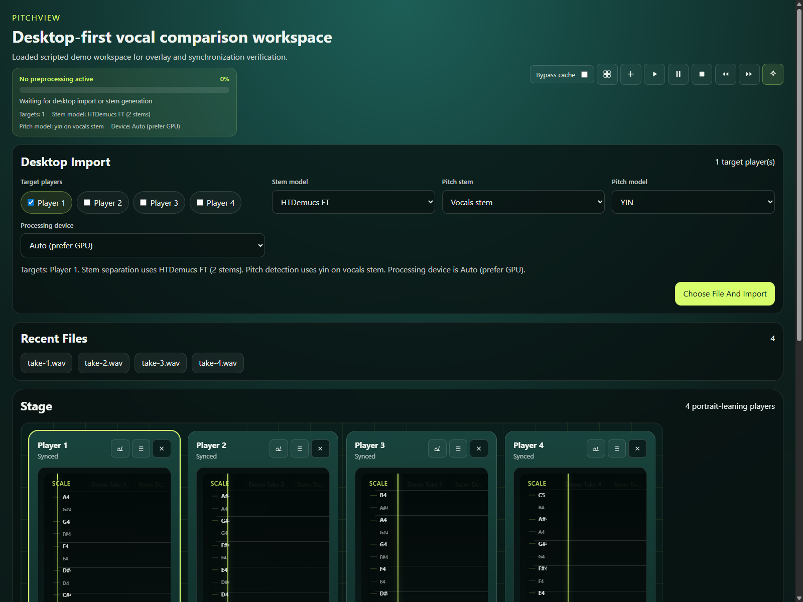
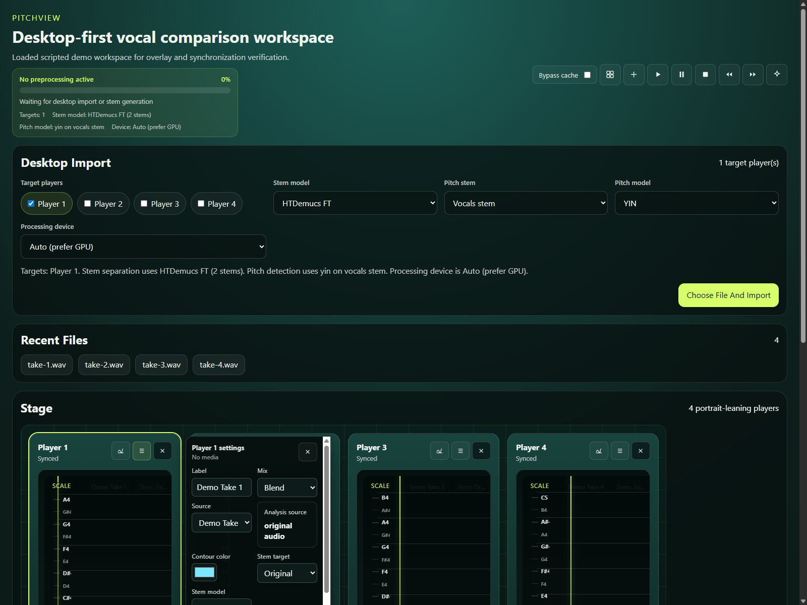
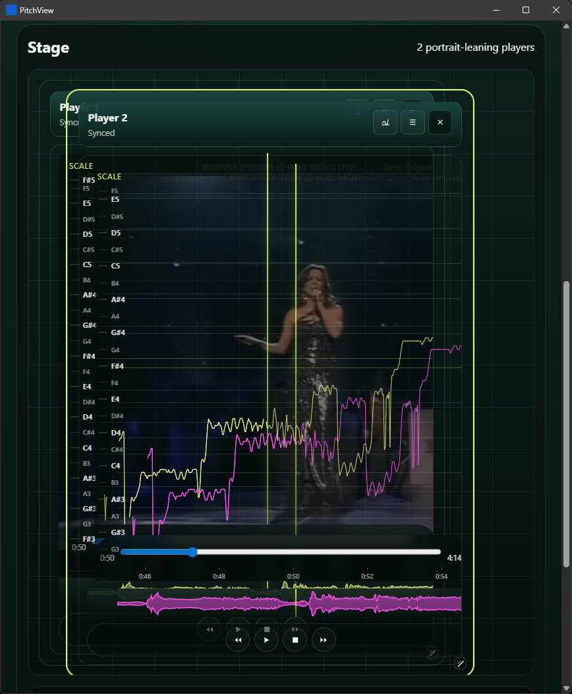

# PitchView

PitchView is a Windows-first desktop application for comparing vocal phrasing, pitch contour, timing, and level across multiple synchronized media layers.

It combines:

- a Tauri desktop shell
- a React and TypeScript workspace UI
- a Python preprocessing pipeline for pitch extraction and stem-aware analysis

PitchView is built for workflows where you want to line up multiple performances, switch between original and separated sources, and inspect pitch movement directly on the player surface instead of in a separate analysis screen.

## Why PitchView

Most media players let you listen. PitchView is built to compare.

It focuses on the questions that come up when you are studying a vocal performance or lining up multiple takes:

- Where does the phrase land against the reference?
- Is the pitch movement smooth, scooped, corrected, or unstable?
- Does the vocal sit earlier or later than another take?
- What changes when you isolate vocals instead of listening to the full mix?

Instead of pushing that work into separate tools, PitchView keeps the comparison workspace, playback controls, and pitch display together.

## What It Does

PitchView currently supports:

- multiple comparison layers in a shared stage
- synchronized or independent playback between layers
- direct media import into desktop layers
- on-player pitch contour overlays
- adjustable pitch and time display settings
- stem-aware playback sources such as original and vocals
- desktop preprocessing with FFmpeg, Demucs, Torch, and TorchCrepe
- automated frontend, backend, and desktop GUI verification workflows

## Workflow Overview

A typical desktop workflow looks like this:

1. Import one or more audio or video files into separate layers.
2. Lock layers together when you want synchronized playback, or leave them independent when you want free comparison.
3. Run desktop preprocessing to normalize media, extract pitch, and generate stems when needed.
4. Switch a layer between sources such as the original mix and vocals.
5. Inspect pitch contour, timing, and phrasing directly on the player surface while scrubbing or playing back.

PitchView is designed so playback-source switching does not implicitly rewrite cached pitch analysis unless you explicitly reprocess or replace the media.

## Architecture

- Desktop host: Tauri
- Frontend: React 19, TypeScript, Vite
- Preprocessing backend: Python in `tools/preprocess_media.py`
- Desktop checks: Rust via Cargo
- GUI automation: WebdriverIO with Microsoft Edge WebDriver

## Current Platform Target

PitchView is currently a Windows-first project.

The supported development workflow assumes:

- Windows PowerShell
- a repository-local Python environment at `.venv`
- Node.js and npm
- Rust and Cargo
- FFmpeg and FFprobe
- an NVIDIA GPU with CUDA 12.6 or newer for the supported GPU preprocessing path

## Screenshots

These screenshots are generated from the desktop app using the scripted demo workspace.

Demo workspace with synchronized comparison layers and overlay-ready stage:



Layer settings open on a demo player, showing source selection and analysis configuration:



Overlapped players with media transparency enabled, showing direct visual and pitch-contour comparison on the shared stage:



To refresh the screenshots after UI changes, run:

```powershell
npm run capture:readme-screenshots
```

## Prerequisites

Run the prerequisite checker first:

```powershell
npm run check:prerequisites
```

It reports detected versions, missing tools, and install help for anything that does not meet the project baseline.

Core prerequisites:

1. Windows 10 or Windows 11
2. Windows PowerShell 5.1 or newer
3. Node.js 20.19.0 or newer
4. npm bundled with that supported Node.js install
5. Python 3.12 or newer, with `py` or `python` available so bootstrap can create `.venv`
6. Rust toolchain 1.77.2 or newer, with `cargo` available; current stable Rust is recommended
7. FFmpeg and FFprobe available from `PATH` or a WinGet installation
8. NVIDIA drivers exposing CUDA 12.6 or newer through `nvidia-smi`

GUI-only prerequisites:

1. Microsoft Edge for `npm run test:gui`
2. Microsoft Edge for `npm run capture:readme-screenshots`

Notes:

- PitchView uses the repository-local `.venv` only. Do not point the app or scripts at another Python environment.
- Bootstrap installs CUDA-enabled `torch` and `torchaudio` into `.venv` based on the CUDA runtime reported by `nvidia-smi`.
- FFmpeg and FFprobe can come from `PATH` or a WinGet installation. The scripts will try both.
- The GUI scripts install `tauri-driver` and `msedgedriver-tool` automatically after the base prerequisites are in place.

## Quick Start

From the repository root:

```powershell
npm run check:prerequisites
npm run bootstrap
npm run run
```

`npm run bootstrap` will:

- create `.venv` if it does not exist
- upgrade `pip` in `.venv`
- install CUDA-enabled Torch packages matched to your runtime
- install Python dependencies from `requirements.txt`
- install npm dependencies
- resolve FFmpeg and FFprobe

`npm run run` launches the Tauri desktop app in development mode.

## Using The App

After the desktop window opens, the usual flow is:

1. Import media into one or more layers.
2. Arrange or resize layers on the stage.
3. Choose whether layers should stay synchronized.
4. Run preprocessing when you need pitch data or separated sources.
5. Switch the playback source for a layer between available stems.
6. Compare pitch contour and timing directly over the media surface.

The project requirement baseline for product behavior lives in [context/requirements.md](context/requirements.md).

## Common Commands

```powershell
npm run bootstrap
npm run run
npm run build
npm run test
npm run test:gui
npm run check:prerequisites
npm run benchmark:preprocess
npm run capture:readme-screenshots
```

What they do:

- `npm run bootstrap`: prepare `.venv`, Python packages, npm packages, and binary dependencies
- `npm run run`: launch the desktop app with `tauri dev`
- `npm run build`: build the frontend and run `cargo check` on the desktop host
- `npm run test`: run frontend tests, demo verification, and Python smoke tests
- `npm run test:gui`: run desktop GUI automation through Edge WebDriver
- `npm run check:prerequisites`: validate required system tools and print install help for anything missing
- `npm run benchmark:preprocess`: run the tracked preprocessing benchmark and refresh the baseline JSON
- `npm run capture:readme-screenshots`: regenerate README screenshots from the desktop app

## Building

Use:

```powershell
npm run build
```

This currently performs:

- frontend production build in `app/frontend`
- desktop host validation in `app/desktop/src-tauri` via `cargo check`

## Testing

Run the standard verification suite with:

```powershell
npm run test
```

That covers:

- frontend unit tests with Vitest
- demo verification via PowerShell helper scripts
- Python backend smoke tests in `tests/`

Run GUI automation separately with:

```powershell
npm run test:gui
```

GUI testing requires:

- Microsoft Edge
- Edge WebDriver
- Rust and Cargo
- the Tauri driver

The GUI script installs missing WebDriver helpers when needed.

## Demo And Validation

PitchView is not just documented with static claims. The repository includes scripted demos and automated validation around the behaviors the app is built to support.

Current coverage includes:

- a scripted demo workspace via the `Load demo` action, backed by [app/frontend/src/demo.ts](app/frontend/src/demo.ts)
- demo verification via [scripts/demo.ps1](scripts/demo.ps1)
- frontend workspace and UI tests via Vitest in `app/frontend`
- Python preprocessing smoke tests and pitch-focused harnesses in [tests](tests)
- desktop import automation in [e2e/specs/desktop-import.e2e.mjs](e2e/specs/desktop-import.e2e.mjs)
- notation-driven GUI pitch accuracy verification in [e2e/specs/stimulus-accuracy.e2e.mjs](e2e/specs/stimulus-accuracy.e2e.mjs)
- reproducible README screenshot capture in [e2e/specs/readme-screenshots.e2e.mjs](e2e/specs/readme-screenshots.e2e.mjs)

The calibrated GUI accuracy flow is driven by the tracked notation fixture [e2e/fixtures/stimulus-accuracy.pvabc](e2e/fixtures/stimulus-accuracy.pvabc), which gives the repository a stable reference signal for checking rendered pitch behavior.

## Benchmarking Preprocessing Runtime

PitchView includes a tracked benchmark harness for the desktop preprocessing path.

Run it with:

```powershell
npm run benchmark:preprocess
```

The benchmark writes a baseline file to `context/benchmarks/preprocess-runtime-baseline.json`.

The current tracked baseline records:

- calibrated stimulus runtime: `1.771s`
- real-world 10-second clip runtime: `2.513s`
- processing device used: `cuda`
- pitch model used: `torch-cuda`

Important caveat:

- the calibrated stimulus is tracked through repo-owned inputs
- the current real-world benchmark still depends on `.tmp/gui-e2e/external_clip.mp4`, and the baseline stores its hash for reproducibility

## Repository Layout

```text
app/
  desktop/            Tauri desktop host
  frontend/           React and TypeScript UI
context/              requirements and benchmark artifacts
e2e/                  GUI automation specs and fixtures
goals/                project workflow goals
scripts/              bootstrap, build, run, test, and benchmark entrypoints
tests/                Python backend tests
tools/                deterministic preprocessing tools
```

## Contributing

The repository default branch is `main`.

Recommended workflow:

1. Branch from `main` for each unit of work.
2. Keep changes focused.
3. Run the relevant verification commands before opening a pull request.
4. Open a pull request back into `main`.

Typical contributor loop:

```powershell
git switch main
git pull
git switch -c your-branch-name
npm run test
git push -u origin your-branch-name
```

If your change affects desktop preprocessing, also run:

```powershell
npm run benchmark:preprocess
```

## Development Notes

- The desktop app is the primary target. Browser-style workflows exist mainly to speed up UI iteration and testing.
- Heavy media work stays in deterministic tools instead of frontend code.
- Source switching is intended to change playback and display source without implicitly regenerating pitch analysis.
- The repository now lives on GitHub and uses `main` as the default branch. Future work can branch from `main` and merge back through pull requests.

## Troubleshooting

### Bootstrap fails because Python cannot be found

Install Python 3, make `py` or `python` available, and rerun:

```powershell
npm run bootstrap
```

### CUDA torch install fails

Check:

- `nvidia-smi` is available
- CUDA runtime is 12.6 or newer
- the installed NVIDIA driver is current enough for your GPU

### FFmpeg is not detected

Install FFmpeg so `ffmpeg.exe` and `ffprobe.exe` are either:

- on `PATH`, or
- available under a WinGet package install location

### GUI tests fail before the app launches

Confirm:

- Microsoft Edge is installed
- Cargo is available
- the machine can download `msedgedriver` and `tauri-driver`

## License

No license has been added to this repository yet.