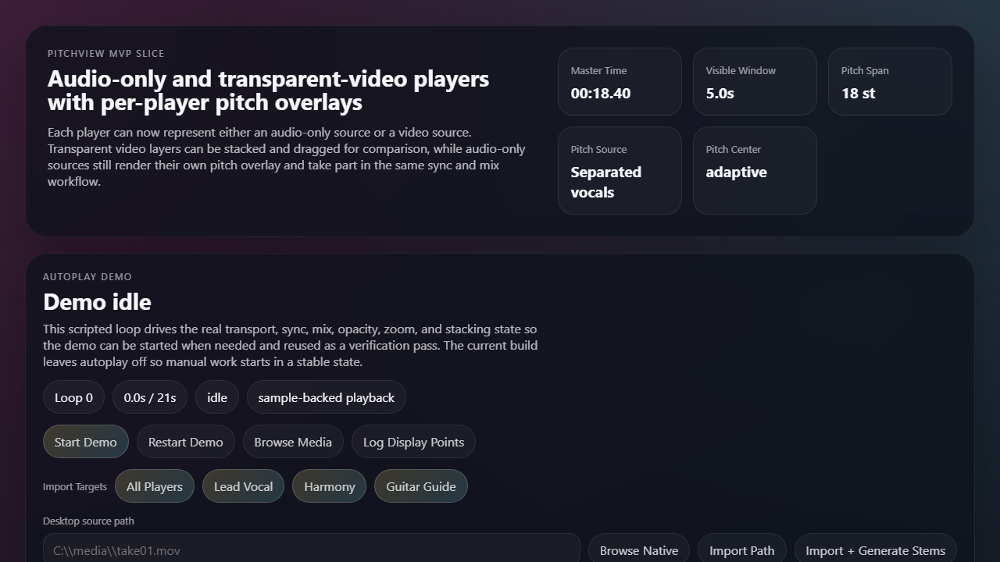
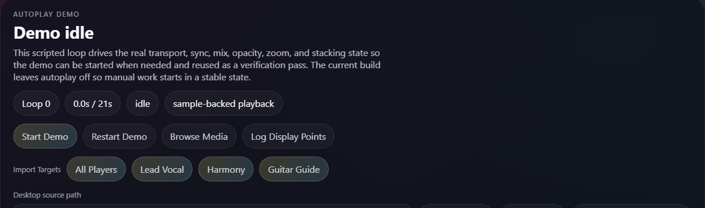

# PitchView

PitchView is a Windows-first desktop media analysis app for comparing vocal phrasing, pitch contour, and timing across multiple synchronized players.

The current build is aimed at practice and analysis workflows where you want to line up one or more recordings, isolate vocals when possible, and inspect pitch movement directly on top of each player.





## What It Does

- loads audio-only or video media into multiple player surfaces
- keeps selected players time-locked for synchronized comparison
- overlays a per-player pitch graph directly on the media layer
- supports browser import and native desktop file selection
- can run desktop preprocessing to generate vocal-focused stems
- lets you target one player, several players, or all players during import
- exposes per-player mix, mute, solo, opacity, order, color, and drag controls
- includes a scripted demo loop for repeatable UI and sync verification

## Current Workflow

The current app supports this flow end to end:

1. Open a media file into one or more player targets.
2. Keep players locked together or let individual players drift independently.
3. Choose the preferred pitch source, with separated vocals favored when available.
4. Run stem generation from the desktop shell through the Python preprocessing worker.
5. Inspect the overlaid contour while adjusting zoom, pitch span, and layer visibility.

## Current Architecture

### Frontend

- React 19
- TypeScript
- Vite

### Desktop shell

- Tauri 2
- Rust command bridge in `src-tauri`

### Audio and pitch analysis

- browser-side YIN analysis through `pitchfinder`
- desktop/offline pitch analysis through the Python worker
- graph rendering and smoothing logic in `src/lib`

### Preprocessing

- Python worker at `tools/preprocess_media.py`
- FFmpeg-backed normalization path
- selectable stem backends and model planning

## Stem Separation Models

The current model workbench includes:

- Vocals Mel-Band Roformer
- HTDemucs FT
- HTDemucs 6 Stem
- MDX23C
- UVR MDX Karaoke
- Spleeter 2 Stem
- Open-Unmix

The intended default path is the Roformer-based vocals workflow when the model and Python dependencies are available.

## Repository Layout

- `src/`: React UI, reducer logic, pitch display, preprocess wrappers
- `src-tauri/`: Tauri desktop backend and Rust commands
- `tools/`: Python preprocess worker and analysis utilities
- `sample/`: bundled sample assets and generated output folders used during development
- `docs/images/`: README screenshots

## Running PitchView

### Browser UI

1. Install dependencies:

	```bash
	npm install
	```

2. Start Vite:

	```bash
	npm run dev
	```

3. Or use the Windows launcher:

	```bat
	launch-demo.bat
	```

### Desktop shell

Use the Windows launcher so the app can pick the Python environment that already contains the preprocessing stack:

```bat
launch-tauri.bat
```

If you need to set the interpreter manually, set `PITCHVIEW_PYTHON` before starting Tauri.

Known good environment used during development:

```text
C:\Users\ericl\AITools\Qwen-Audio\.venv\Scripts\python.exe
```

## Testing

Run the automated test suite with:

```bash
npm test
```

The current suite covers reducer workflow behavior, pitch display shaping, pitch analysis helpers, preprocess planning, and Tauri wrapper behavior.

## Utility Scripts

- `npm run scan:display-glitches`
- `npm run benchmark:pitch-detectors`

These are development diagnostics used to evaluate contour rendering and detector behavior.

## Current Limitations

- project persistence is not implemented yet
- the desktop preprocessing flow depends on an external Python environment
- backend availability depends on which models and Python packages are installed locally
- the UI is functional but still in active refinement

## Status

PitchView is past the scaffold stage and already supports real media import, real pitch extraction, real stem-generation workflows, and automated tests. It is still an active development repository rather than a finished product release.
# PitchView

Initial implementation slice for a Windows-first desktop application that will support:

- audio-only input or video input
- multiple synchronized players
- stacked transparent video layers when the source preserves alpha
- one pitch display per player, overlaid directly on that player's video
- per-player mute, mix, and solo state
- flexible media ingest across multiple containers and codecs via FFmpeg

Supported ingest direction for the product boundary now includes:

- audio-only files such as WAV, MP3, FLAC, M4A, and AIFF
- video files such as MP4, MOV, MKV, and WebM
- multiple audio codecs including MP3, AAC, and PCM variants
- transparent video workflows when the source format actually carries alpha

## Current slice

This repository currently includes:

- a Tauri desktop scaffold
- a React and TypeScript UI shell
- a sync-aware reducer for locked and unlocked player transport
- mock player metadata for audio-only and video-based sources
- the bundled sample clip loaded into every player for real sync-preview playback
- browser-side media import that can load one selected audio or video file into one player, several players, or all players
- desktop path-based import that can assign local media to selected players and run the Python stem worker against that source
- browser-side pitch extraction from decoded audio for the overlaid contour display
- media-clock synchronization so player positions follow the actual video elements more closely than a fixed timer
- one pitch overlay per player with adjustable time and pitch scales
- a graph-stem preference so pitch analysis can stay on a mostly fixed source, with vocals as the default when available
- adaptive pitch centering so the visible graph range can follow the current singer range instead of staying fixed around middle C
- per-player controls for line color, line width, opacity, layer order, mix mode, and drag position
- explicit per-player width and height controls so layer resizing does not depend on mouse cursor feedback
- stem-aware player state with selectable source and generated stem tracks
- a stem-model workbench with multiple AI vocal-separation candidates
- a start-on-demand demo loop that exercises transport, sync, mix, zoom, opacity, and stacking behavior
- a Rust backend boundary with stubbed commands for FFmpeg-backed media import and analysis

The current UI is designed around overlay comparison: lower a player's opacity, drag it over another player, and compare whether each player's pitch contour aligns visually.

This slice does **not** yet include Rust-side FFmpeg integration, stem remuxing, or persistent project storage.

## Demo mode

The UI now includes an optional demo mode intended for two purposes:

1. Show a prospective user what the product can do without requiring manual interaction.
2. Provide a repeatable visual verification pass for sync, overlay, mix-mode, and scaling behavior.

The scripted demo currently exercises:

- locked playback starting in sync
- layer opacity changes for visual comparison
- time-scale and pitch-range zoom changes
- unlocking and relocking a player
- solo, mixed, and muted routing changes
- switching between real bundled sample stems for the AI-processed sample path
- dragging and restacking the overlay surfaces

## Import and preprocessing workbench

The current build now lets you load a browser-selected media file into all players from the UI. This is the active fallback path because FFmpeg and `ffprobe` were not available on PATH in the current environment.

In the desktop shell, the UI also accepts a local source path. That path-based flow can:

1. assign the imported media to the selected players
2. convert the local file path into a playable Tauri asset URL
3. launch the Python preprocessing worker directly against that source
4. attach generated `vocals` and `other` stems back onto the selected players when the worker returns outputs

The app also includes a stem-model workbench with multiple candidate vocal-separation models:

- Vocals Mel-Band Roformer (`vocals_mel_band_roformer.ckpt`) as the preferred default when available
- HTDemucs FT
- HTDemucs 6 Stem
- MDX23C
- UVR MDX Karaoke
- Spleeter 2 Stem
- Open-Unmix

Those models are tied into the application as selectable AI separation strategies and backend metadata. FFmpeg is only part of media ingest and normalization around the model inference path; it is not the stem-separation engine.

For `vocals_mel_band_roformer.ckpt`, the worker can now take an explicit checkpoint path with `--model-file`, or resolve the file from `PITCHVIEW_MODEL_FILE` or a local `models/` or `checkpoints/` directory.

There is now also a Python worker scaffold at `tools/preprocess_media.py` that can:

1. detect which stem-separation backends are installed
2. download supported AI model files through the backend registry when available
3. generate a model-specific preprocess plan for a chosen source
4. normalize media audio into a mono 44.1 kHz PCM WAV using FFmpeg or the bundled `imageio-ffmpeg` fallback
5. execute a real AI separation command when the required backend and model files are present

In the current environment, the worker validated successfully in `detect`, `plan`, and `normalize` mode. The verified state is:

- Python available
- FFmpeg available through `imageio-ffmpeg`
- ffprobe not currently available
- Demucs not currently available
- Spleeter not currently available
- Open-Unmix not currently available
- Audio Separator available in the configured Python environment

The primary vocal-separation path is now `audio_separator` plus the selected AI checkpoint. FFmpeg remains a support dependency for decode and audio file handling only.

The preferred Roformer checkpoint is now downloaded into `models/vocals_mel_band_roformer.ckpt`, and a real AI separation run succeeded against the bundled sample, producing `vocals` and `other` stem WAV files under `sample/out/roformer-ai-direct2/`. The current sample-backed demo now points its stem switching at those generated assets.

The sample asset was successfully normalized to `sample/out/normalized.wav` through the worker.

## Sample-backed playback

The `sample` folder now contains a bundled `.webm` clip that is loaded into each player so the current prototype can:

1. visually verify synchronized playback using a real video element
2. show how the same source behaves across multiple locked players
3. provide a concrete asset for future FFmpeg probing and preprocessing work

## Planned preprocessing pipeline

The requirements now include a preprocessing pass that separates vocals from the source audio before playback metadata is finalized.

Current product direction:

1. Use FFmpeg or `ffprobe` to inspect the source container and normalize the audio and video streams.
2. Run vocal separation on the normalized audio to produce at least the original mix, separated vocals, and an instrumental stem.
3. Expose those derived stems as selectable playback tracks in the UI.
4. Prefer multi-track containers when practical, but do not depend on them; sidecar stem files are acceptable if the player can switch between them during playback.

The demo is off by default. It can be started, paused, resumed, or restarted from the UI.

## Run

1. Install JavaScript dependencies with `npm install`.
2. Run the UI in browser mode with `npm run dev`.
3. Run the desktop shell with `launch-tauri.bat` once the Tauri prerequisites are installed. This launcher selects a Python interpreter only if it contains the preprocessing dependencies and starts the Tauri frontend on `127.0.0.1:1430` so it does not collide with the browser demo port.
4. On Windows, launch the browser demo with `launch-demo.bat`. If the demo is already running on `127.0.0.1:1420`, the script reuses it; if another process owns that port, the script picks the next free local port.

If you prefer running Tauri manually, set `PITCHVIEW_PYTHON` first so the desktop app uses the Python environment that has the stem-separation backend installed.

## Next implementation targets

1. Replace pasted source paths with a native Tauri open-file dialog so desktop import is less manual.
2. Implement Rust-side FFmpeg probing and metadata extraction around imported files.
3. Persist project state and imported media settings.
4. Add preprocess progress reporting instead of a single completion message.